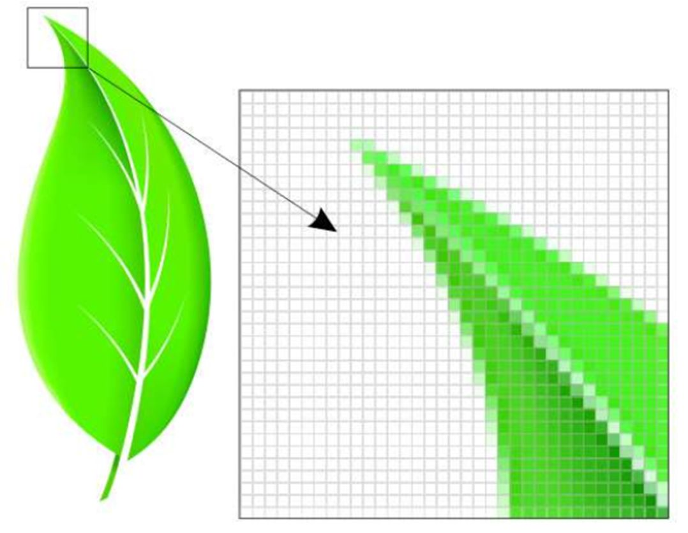

```{r xaringanExtra, echo=FALSE}
xaringanExtra::use_xaringan_extra(c("tile_view", "animate_css", "tachyons"))
```

```{r xaringan-panelset, echo=FALSE}
xaringanExtra::use_panelset()
```

```{r xaringan-scribble, echo=FALSE}
xaringanExtra::use_scribble()
```

```{r xaringan-logo, echo=FALSE}
xaringanExtra::use_logo(
  image_url = "Unsera.png"
)
```

```{r xaringanExtra-webcam, echo=FALSE}
xaringanExtra::use_webcam()
```

```{r xaringanExtra-search, echo=FALSE}
xaringanExtra::use_search(show_icon = TRUE)
```


.pull.center[

# **Pengajar**

]

.pull-left[

## Nama : .blue[Riana Hadiana (Dian)]
## Pendidikan : .blue[S2 Statistika Terapan]
## Website : https://masdian.github.io
## email : .blue[riana.hadiana@gmail.com]
## Twitter : .blue[@rianahadiana]


]

.pull-right[

<center>
<div style="width:350px; height:500px">


]

---

.pull-left[

# .purple[**Outline**]

- ## Pendahuluan<br>
- ## Matriks dan Notasinya<br>
- ## Aplikasi Aljabar - Matriks
- ## Operasi/pengolahan Dasar Matriks

]

.pull-right[

<br><br><br><br>


]

---

class: center, middle, inverse

# .red[**PENDAHULUAN**]


---
.pull.center[
# **Materi Pokok**
]

.pull-left[

## Materi UTS
- Matriks dan Operator Pengolahnya
- Jenis-Jenis Matriks dan Determinan
- Determinan
- Invers Matriks
- Matriks Echelon dan Pangkat Matriks
- Sistem Persamaan Linear (SPL)
- Sistem Persamaan Linear (SPL) lanjutan

]

.pull-right[

## Materi UAS
- Vektor
- Ruang Vektor
- Ruang Vektor
- Transformasi Linier
- Transformasi Linier
- Nilai Eigen dan Vektor Eigen
- Nilai Eigen dan Vektor Eigen


]

---

.pull.center[
# **Kontrak Perkuliahan**
]

- ## Toleransi waktu keterlambatan .red[15 menit].
- ## Berpakaian dan berperilaku sopan sesuai dengan aturan di Unsera
- ## Tidak ada ujian susulan kecuali bagi mahasiswa yang sakit atau menjalankan tugas institusi dan dibuktikan dengan surat keterangan dari fakultas/universitas
- ## Mahasiswa dengan tingkat .red[kehadiran kurang dari 80% tidak diperkenankan untuk mengikuti UAS].

---

.pull.center[
# **Referensi**
]

- ## Martono, Totong. 2017. [.blue[Aljabar Matriks untuk Metode Kuantitatif]](https://www.google.co.id/books/edition/Aljabar_Matriks_untuk_Metode_Kuantitatif/1mb5DwAAQBAJ?hl=id&gbpv=0&kptab=overview). Penerbit IPB Press.
- ## Wijayanti, I, E, dkk. 2018. [.blue[Dasar-Dasar Aljabar Linear dan Penggunaannya dalam berbagai bidang]](https://play.google.com/store/books/details/Indah_Emilia_Wijayanti_Dasar_Dasar_Aljabar_Linear?id=wmdVDwAAQBAJ). Gadjah Mada University Press
- ## Pustaka lain yang relevan


---

class: center, middle, inverse

# .red[**Matriks dan Notasinya**]


---

.pull.center[
# **Tampilan Matriks**
]
.pull-left[

## $\begin{bmatrix} 1 & 2 \\ 3 & 4 \end{bmatrix}$

## $\begin{bmatrix} -4 & 3 & 2 \\ 0 & 1 & 6 \end{bmatrix}$

]

.pull-right[

## $\begin{bmatrix} 8 & 0 & 1 & 9\\ 6 & 4 & 7 & 8\\ 9 & 9 & -1 & 4 \end{bmatrix}$

]

---

.pull.center[
# **Notasi Dasar Matriks**
]

- ## $\textbf{A}_{m\times n}$, $[a_{ij}]_{m\times n}$ : matriks berukuran $m \times n$ ( $m$ baris dan $n$ kolom)
- ## Konversi penulisan nama matriks: .red[HURUF KAPITAL], .red[**tebal**]
- ## $a_{ij}$ adalah elemen matriks $\textbf{A}$ pada baris ke- $i$ dan kolom ke- $j$


---

class: center, middle, inverse

# .red[**Aplikasi Aljabar - Matriks**]

---

.pull.center[
# **Image Analysis**
]

<center>
<div style="width:600px; height:500px">


---

.pull.center[
# **Image Analysis**
]

- ## Memperkirakan luas sawah berdasarkan citra satelit
- ## Menghitung banyaknya pohon di kebun dari foto drone
- ## Menghitung banyaknya demonstran berdasarkan foto citizen
- ## Memperkirakan kemacetan dari CCTV polisi
- ## ???

---

.pull.center[
# **Network Analysis**
]

<center>
<div style="width:800px; height:400px">


---

.pull.center[
# **Network Analysis**
]

<center>
<div style="width:980px">


---
.pull.center[
# **Network Analysis**
]
<br><br>
<center>
<div style="width:980px">


---

.pull.center[
# **Network Analysis**
]

- ### Social Network Analysis: mencari centrality setiap individu
    - Mengidentifikasi akun medsos yang potensial jadi penyebar informasi dan memasang iklan online
    - Melacak jaringan teroris
- ### Inter-bank Transaction: analisis pasar uang antar bank
- ### Export-Import Analysis: melihat ketergantungan satu negara dengan negara lain
- ### Analisis transfer dana untuk mendeteksi perilaku pencucian uang oleh PPATK (Pusat Pelaporan dan Analisis Transaksi Keuangan)

---

.pull.center[
# **Computation**
]

<center>
<div style="width:500px">


---

.pull.center[
# **Coding and Decoding Message**
]

.pull-left[


]

.pull-right[


]

---

.pull.center[
# **Coding and Decoding Message**
]

.pull-left[


]

.pull-right[


]


---

.pull.center[
# **Coding and Decoding Message**
]

<center>
<div style="width:800px">


---

class: center, middle, inverse

# .red[**Operasi/pengolahan Dasar Matriks**]

---

.pull.center[
# **Penjumlahan**
]

- ### Penjumlahan matriks $\textbf{A}_{m \times n}$ dan $\textbf{B}_{m \times n}$ menghasilkan matriks baru $\textbf{C}_{m \times n}$ dengan 

### $$c_{ij}=a_{ij}+b_{ij}$$

- ### Perhatikan bahwa ukuran matriks $\textbf{A}$ dan $\textbf{B}$ harus sama

---

.pull.center[
# **Penjumlahan**
]

.pull-left[

### $$\textbf{A}=\begin{bmatrix} -4 & 3 & 2 \\ 0 & 1 & 6 \\ 8 & 8 & 5 \end{bmatrix}$$


]

.pull-right[

### $$\textbf{B}=\begin{bmatrix} 3 & 4 & 8 \\ 5 & 3 & 2 \\ 1 & 5 & 9 \end{bmatrix}$$

]

### $$\textbf{A}+\textbf{B}=\begin{bmatrix} -1 & 7 & 10 \\ 5 & 4 & 8 \\ 9 & 13 & 14 \end{bmatrix}$$

---

.pull.center[
# **Penjumlahan**
]

.pull-left[

### $$\textbf{A}=\begin{bmatrix} -4 & 3 & 2 \\ 0 & 1 & 6 \\ 8 & 8 & 5 \end{bmatrix}$$


]

.pull-right[

### $$\textbf{B}=\begin{bmatrix} 3 & 4 & 8 & 3 \\ 5 & 3 & 2 & 5 \\ 1 & 5 & 9 & 0 \end{bmatrix}$$

]

<br><br><br>
### $$\textbf{A}+\textbf{B}=???$$

---

.pull.center[
# **Penjumlahan**
]

.pull-left[

### Sifat dasar penjumlahan matriks
- ### Komutatif :<br> $\textbf{A}+\textbf{B}=\textbf{B}+\textbf{A}$
- ### Asosiatif : $(\textbf{A}+\textbf{B})+\textbf{C}=\textbf{A}+(\textbf{B}+\textbf{C})$

]

--

.pull-right[

<br><br><br>

## .red[Buktikan Sifat tersebut!!!]

]

---

.pull.center[
# **Perkalian Matriks dengan Skalar**
]

### Jika $c$ adalah sebuah skalar/konstanta real dan $\textbf{A}_{m \times n}$ adalah sebuah matriks real maka

### $$c \times \textbf{A}_{m \times n}=\textbf{B}_{m \times n}$$

### dengan $b_{ij}=c \times a_{ij}$ untuk semua $(i,j)$

### Sifat perkalian matriks dengan skalar:

### $$c(\textbf{A}+\textbf{B})=c\textbf{A}+c\textbf{B}$$

---

.pull.center[
# **Perkalian Matriks dengan Skalar**
]

<br><br><br>
### $$\textbf{A}=\begin{bmatrix} 2 & 1 & 5 \\ 8 & 4 & 0 \\ 1 & 3 & 6 \end{bmatrix} \Leftrightarrow 2\textbf{A}=\begin{bmatrix} 4 & 2 & 10 \\ 16 & 8 & 0 \\ 2 & 6 & 12 \end{bmatrix}$$

---

.pull.center[
# **Perkalian Matriks dengan Matriks**
]

### Perkalian dua buah matriks $\textbf{A}_{m \times n}$ dan $\textbf{B}_{n \times p}$ dinotasikan $\textbf{AB}$, akan menghasilkan matriks baru $\textbf{C}_{m \times p}$ dengan

### $$c_{ij}=\sum_{k=1}^{n}a_{ik}b_{kj}$$

### untuk semua $(i,j)$


---

.pull.center[
# **Perkalian Matriks dengan Matriks**
]

### Perhatikan ukuran matriks yang terlibat dalam perkalian


---

.pull.center[
# **Perkalian Matriks dengan Matriks**
]


### $$\textbf{A}_{2\times 3}=\begin{bmatrix} 2 & 1 & 5 \\ 1 & 3 & 6 \end{bmatrix} \qquad \textrm{dan} \qquad \textbf{B}_{3 \times 2}=\begin{bmatrix} 2 & 0 \\ 6&2 \\ 1&3 \end{bmatrix}$$


### $\textbf{C}_{2 \times 2}=\textbf{AB}=\begin{bmatrix} 2\times2+1\times6+5\times1 & 2\times0+1\times2+5\times3 \\ 1\times2+3\times6+6\times1 & 1\times0+3\times2+6\times3\end{bmatrix}$

### $\textbf{C}_{2\times2}=\textbf{AB}=\begin{bmatrix} 15&17 \\ 26&24 \end{bmatrix}$

.pull-right[

]

---

.pull.center[
# **Perkalian Matriks dengan Matriks**
]

### Sifat-sifat:
- ### Tidak komutatif: $\textbf{AB}$ belum tentu sama dengan $\textbf{BA}$
- ### $\textbf{A}(\textbf{B}+\textbf{C})=\textbf{AB}+\textbf{AC}$
- ### $c(\textbf{AB})=(c\textbf{A})\textbf{B}=\textbf{A}(c\textbf{B})$


## .red[Buktikan sifat-sifat di atas!!!]

---

.pull.center[
# **Transpose (putaran) Matriks**
]

### Transpose dari matriks $\textbf{A}_{m\times n}$ dilambangkan $\textbf{A}^T$ atau $\textbf{A}'$ adalah matriks $\textbf{B}_{n\times m}$ dengan

### $$b_{ij}=a_{ji}$$

### untuk semua $(i,j)$

### $$\textbf{A}_{2\times3}=\begin{bmatrix} 2&1&5 \\ 1&3&6 \end{bmatrix} \qquad \textbf{B}_{3\times2}=\textbf{A}^T=\begin{bmatrix} 2&1 \\ 1&3 \\ 5&6 \end{bmatrix}$$

---

.pull.center[
# **Transpose (putaran) Matriks**
]

.pull-left[
### Sifat-sifat:

- ### $(\textbf{A}')'=\textbf{A}$
- ### $(\textbf{A}+\textbf{B})'=\textbf{A}'+\textbf{B}'$
- ### $(c\textbf{A})'=c\textbf{A}'$
- ### $(\textbf{AB})'=\textbf{B}'\textbf{A}'$
]

--

.pull-right[

<br><br><br><br><br><br>
## .red[Buktikan!!!]

]

---

.pull.center[
# **Latihan**
]

.pull-left[
Diberikan matriks-matriks:

$\textbf{A}=\begin{bmatrix} 3&2&0 \\ 4&1&5 \end{bmatrix}$

$\textbf{B}=\begin{bmatrix} 1&8&1 \\ 0&4&1 \end{bmatrix}$

$\textbf{C}=\begin{bmatrix} 4&6&3 \\ 4&2&2 \\ 6&1&2\end{bmatrix}$

]

.pull-right[
Hitunglah

1. $\textbf{A}+\textbf{B}$
1. $3\textbf{A}-2\textbf{B}$
1. $\textbf{A}+\textbf{C}$
1. $\textbf{AB}$
1. $\textbf{A}'\textbf{B}'$
1. $\textbf{A}'\textbf{B}$
1. $\textbf{A}\textbf{B}'$
1. $\textbf{A}'\textbf{B}$
1. $\textbf{C}\textbf{B}'$
1. $\textbf{C}\textbf{A}'$
]


---

class: inverse, middle, center

# Thank you
# See you next week!

